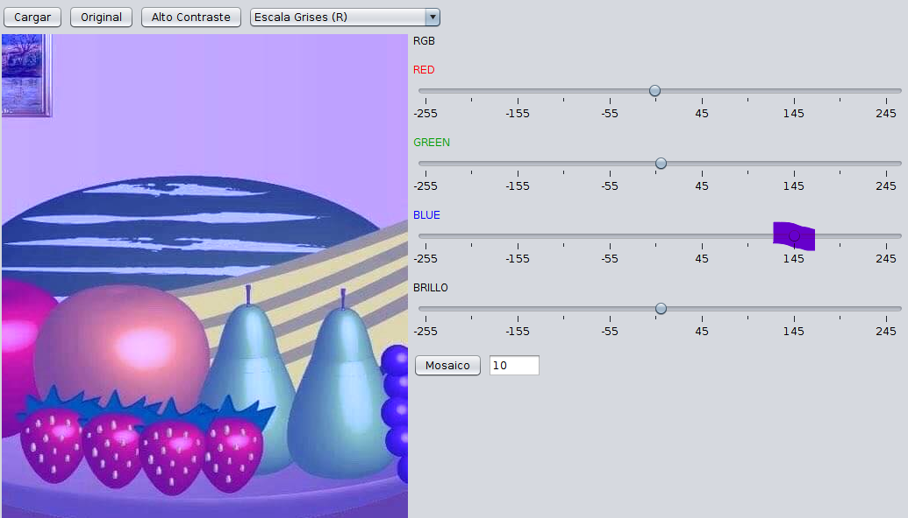

# Manejo de filtros básicos en imágenes.
## Emmanuel Cruz Hernández.

----

## Descripción
Se da el manejo con una interfaz gráfica que permite cargar una imagen y aplicarle algunos filtros tales como
alto contraste, escala de grises, RGB, mosaico y brillo.

### Alto contraste
Para este filtro se lee el color RGB de cada pixel y verificamos si el color es mayor a 128, de ser así a ese pixel le ponemos un color blanco, en otro caso le damos un negro y lo mostramos en la interfaz con los cambios.

### Mosaico
Para llevar a cabo este filtro, se saca el promedio del color de cada uno de los pixeles y aplicamos ese mismo promedio de color a ciarta cantidad de pixeles adyacentes al mismo. La cantidad de espacio de donde se toman los intervalos de aplicación de color esta dado por un parámetro. En la interfaz gráfica este parámetro se pasa a través de un cuadro de texto, al ingresar el valor numérico se preciona el botón "Mosaico" y se reflejan los cambios.

### RGB
Para este método se usan 3 parámetros que serán valores de cambió al Rojo, Verde o Azul de un color. Estos parámetros influyen en si se aumenta o diminuye un color específico sobre la imagen en cuestión. En la interfaz gráfica estos parámetros están dados por sliders que contienen la etiqueta del color que están modificando.

* Aumentando color rojo

* Disminuyendo color rojo

* Aumentando color verde

* Disminuyendo color verde

* Aumentando color azul

* Disminuyendo color azul

### Brillo
El brillo también está controlado por un slider. En el método se recibe un parámetro que será el factor de cambio del brillo. Es decir, este factor se le sumará o restará (dependiendo el caso) a cada uno de los pixéles para generar un nuevo color por pixel que corresponderá a la nueva imagen con el filtro aplicado.

* Aumentando brillo

* Disminuyendo brillo

----

## Escala de grises
Para este caso se implementaron 5 formas de generar el color gris en una imagen.

### (R+G+B)/3
Obtiene el color Rojo, Verde y Azul por pixel. Con la suma de estos se genera un nuevo color que será el que tiene aplicado el filtro con cambio de grises.

### (R * 0.29+G * 0.59 + B * 0.12)
Obtiene el tono de gris obteniendo el color RGB de cada pixel y realizando la operación anterior teniendo los colores primarios. Con este resultado se crea un nuevo color que tendrá como parámetro el resultante de la operación en este caso.

### (R)
Se obtiene el color rojo de cada pixel y este se pasa como parámetro a un nuevo color en la entrada de rojo, verde y azul. Con este color se crea una imagenl, dando a cada pixel el color resultante del color que ya habíamos obtenido anteriormente.

### (G)
Similar al caso a anteior, obtenemos el color G o verde de cada pixel de la imagen a aplicar el filtro. Creamos un nuevo color y le pasamos como parámetro el verde en todas sus entradas. Este cambio se lo aplicamos a cada pixel de la imagen. Este genera otro filtro con escala de gris.

### (B)
Finalmente hacemos lo mismo que en los casos anteriores, pero con el color B o Azul. Cabe mencionar que estos grises los podemos seleccionar desde una barra desplegable en la interfaz gráfica.

----

### PASOS PARA COMPILAR Y EJECUTAR EL PROYECTO
1. Abrir la terminal en el proyecto al nivel del archivo _build.xml_.
2. Ingresar los comandos
	* ant jar
	* ant run
3. De inmediato aparecera la interfaz gráfica en ejecución lista para aplicar filtros.

----

## SOBRE EL PROYECTO
Cuando cargo la imagen, a veces el cuadro para seleccionarla aparece atrás de la interfaz o ventana principal. Por lo que, se debe dar un click sobre la ventana principal de la interfaz para llevar al frente la opción de selección de una imagen.

